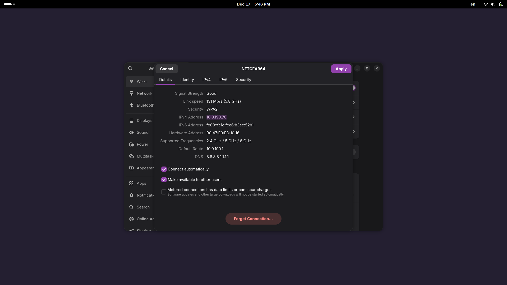
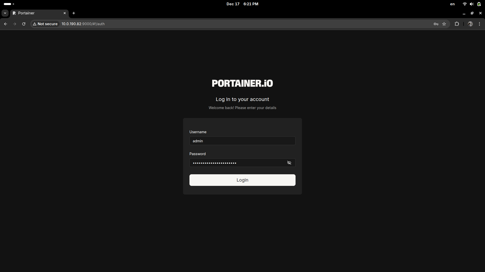
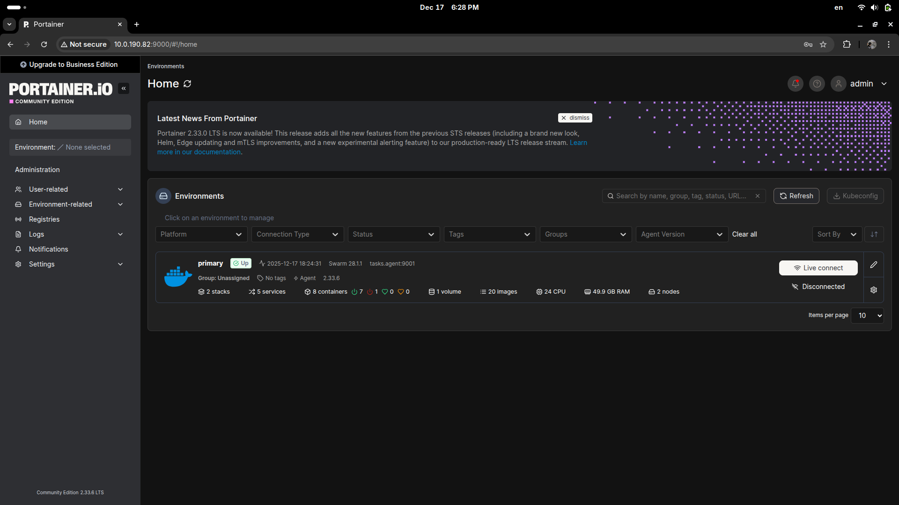
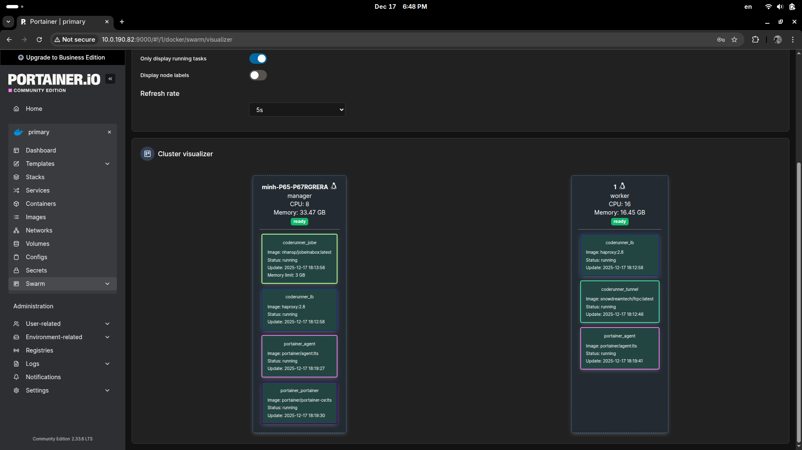

# Insanely stupid scripts to install Docker, join a Docker Swarm, and configure as a node to run [jobeinabox](https://github.com/trampgeek/jobeinabox) for Moodle CodeRunner's plugin.

[](https://hub.docker.com/r/nhansp/jobeinabox/) [](https://hub.docker.com/r/nhansp/jobeinabox/)

## ⚠️ WARNING: This only serves as MVP, and is NOT ready for mass scaling.


## [Prequisites](#prequisites)

* CPU: Intel/AMD (technically, jobeinabox can still be built for arm64, but we are not ready to introduce more quirks yet); preferrably 8 cores or more

* RAM: 8GB or more

* Disk: TBD (~20GB?)

* OS: Ubuntu/Arch Linux/..., or Windows ([highly NOT recommended, see why](#windows-is-stupid))

## [Deployment](#deployment)

0. Setup your nodes

    Your setup needs to be on the same subnet mask and share the same IP range, in order for Docker and other services to "see" each other.

    This can be achieved by:
    
    * Either connect all your devices in the same LAN/WLAN, if you are able to setup everything on the same interface,
    
    * Or setting up your routers (for WLAN it needs to be set to AP mode) so that the devices are all visible on the same subnet.

    For example, consider this setup:

    ```bash
    ~/coderunner ❯ ip a
    [...]
    3: wlan0: <BROADCAST,MULTICAST,UP,LOWER_UP> mtu 1500 qdisc noqueue state UP group default qlen 1000
        link/ether b0:47:e9:ed:10:16 brd ff:ff:ff:ff:ff:ff
        #vvvvvvvvvvvvvvvvvv Docker Swarm Worker
        inet 10.0.190.70/23 brd 10.0.191.255 scope global dynamic noprefixroute wlan0
        valid_lft 3395sec preferred_lft 3395sec
        inet6 fe80::fc1c:fce6:b3ec:52b1/64 scope link noprefixroute 
        valid_lft forever preferred_lft forever
    [...]

    ~/coderunner ❯ arp -a
    ? (10.0.190.82) at 80:fa:5b:21:35:34 [ether] on wlan0 # <---- Docker Swarm Manager
    ? (10.0.190.89) at 6c:70:cb:96:0d:68 [ether] on wlan0
    ? (10.0.190.61) at 6c:70:cb:1f:c5:81 [ether] on wlan0
    _gateway (10.0.190.1) at ac:71:2e:af:68:44 [ether] on wlan0
    ```

    We can observe the IP range of `10.0.190.x` on the Docker Swarm devices.

1. Setup for **Swarm Leader/Manager**

    **⚠️ For the best experience, Swarm Leader/Manager should be using Linux. Windows installation will not be covered here.**

    **[🚫 DO NOT LET THE DOCKER SWARM LEADER DIE IF YOU CAN NOT MAINTAIN QUORUM!!!](https://docs.docker.com/engine/swarm/admin_guide/#maintain-the-quorum-of-managers)**

    - Follow [Docker's official Ubuntu installation guide here.](https://docs.docker.com/engine/install/ubuntu) Or, it's a much easier thing to install for Arch Linux:

        ```bash
        ~/coderunner ❯ sudo pacman -Sy docker --noconfirm
        ```
    
    - Next, allow for the current user to execute Docker commands. This part is taken out from the `swarm` script:

        ```bash
        # 4. Start and Enable Service
        log "Enabling and starting Docker service..."
        systemctl enable --now docker

        # 5. Add User to Docker Group (Rootless usage)
        # Identify the user who ran sudo
        REAL_USER=${SUDO_USER:-$USER}

        if [ "$REAL_USER" != "root" ]; then
            log "Adding user '$REAL_USER' to the docker group..."
            usermod -aG docker "$REAL_USER"
            success "Docker installed successfully!"
            echo -e "${GREEN}IMPORTANT:${NC} You must log out and log back in for group changes to take effect."
            echo -e "Alternatively, run: ${BLUE}newgrp docker${NC}"
        else
            success "Docker installed successfully as root."
        fi
        ```

    - Then, initalize the Swarm.

        * First, get your current IP address, whatever the method you like it:

            

            In this image, `10.0.190.70` is the IP of the current machine.

        * Then, allow some of the ports.
            
            The `allow-ports`/`allow-ports.ps1` scripts are made and ran manually, since we are not sure if the script will mess up your firewall configuration. Please check the scripts accordingly.

            ```bash
            ~/coderunner ❯ ./allow-ports
            ```

        * Now, execute the Swarm initialization:

            ```bash
            ~/coderunner ❯ docker swarm init --advertise-addr 10.0.190.70:2377

            Swarm initialized: current node (rmwm3fo7jwfd8mp7kowcgt03e) is now a manager.

            To add a worker to this swarm, run the following command:

                docker swarm join --token ballsitch 10.0.190.70:2377

            To add a manager to this swarm, run 'docker swarm join-token manager' and follow the instructions.
            ```

            Notice the Swarm join command, as we will need this in the next step.


2. Execute `swarm`/`swarm.ps1` script for the **Swarm Workers**

    - **Linux only**: rename `.env.example` to `.env` and fill in the token and IP address:

        ```bash
        # Put your Docker Swarm Manager IP and join token here.
        # Then, rename this file to .env for the swarm script to source.
        # If you're intending to public your Swarm, DO NOT leak this file!!!

        SWARM_MANAGER_IP=10.0.190.70
        SWARM_JOIN_TOKEN=ballsitch
        ```

    - For Linux, execute the `swarm` script as root/with sudo (for now, only Ubuntu and Arch Linux are supported):

        ```bash
        ~/coderunner ❯ sudo ./swarm
        ```

    - For Windows, fill in the Swarm join token and IP, then execute the `swarm.ps1` script with Administrator rights.

        ```powershell
        PS C:\Windows\System32> .\swarm.ps1
        ```

3. Configure a reverse tunnel for `jobe` judge requests

    _TODO: @thayminhdeptrai can u finish this...? i was braindead at this point, will need to **ssh moodle for materials**_

    - Create an A record `jobe`: `jobe.ftds.online`
    
    - SSH to the Moodle instance, open port 7000, 8080

    - Install [frp](https://github.com/fatedier/frp) to `PATH` or anywhere, then make a systemd service for consistency. The command to run for `frps` service is `/foo/bar/frps -c /bar/foo/frps.toml`.

        `frpc.toml` should look like this:

        ```bash
        bindPort = 7000        # Communication with the Swarm
        vhostHTTPPort = 8080   # Listen for HTTP on 8080
        auth.token = "ballsitch"
        ```

    - Create new cfg file `/etc/apache2/sites-available/jobe.conf`:
        
        ```apache
        <VirtualHost *:80>
            ServerName jobe.ftds.online

            ProxyPreserveHost On
            ProxyPass / http://127.0.0.1:8080/
            ProxyPassReverse / http://127.0.0.1:8080/
        </VirtualHost>

    - Enable the site and reload:

        ```bash
        a2enmod proxy proxy_http
        a2ensite jobe
        systemctl reload apache2
        ```

    - On the **Swarm Leader**, config `frpc` (as systemd) which the following `frpc.toml`:

        ```bash
        serverAddr = "ftds.online"
        serverPort = 7000
        auth.token = "ballsitch"

        [[proxies]]
        name = "jobe_tunnel"
        type = "http"
        localIP = "lb"
        localPort = 80
        customDomains = ["jobe.ftds.online"] # The subdomain we set up
        ```

4. Deploy `jobeinabox` and `portainer` on the **Swarm**

    - Import the needed configs needed for the Docker Compose file:

        ```bash
        (base) minh@minh-P65-P67RGRERA:~$ sudo su
        root@minh-P65-P67RGRERA:/home/minh# cd /opt/coderunner/
        root@minh-P65-P67RGRERA:/opt/coderunner# docker config create haproxy_cfg ./haproxy.cfg 
        ansjdonl9b5lhnkfyqtkq2vrw
        root@minh-P65-P67RGRERA:/opt/coderunner# docker config create frpc_cfg_2 ./frpc.cfg 
        kil0v8q9lo0oimzvszgwafgsk
        ```
    
    - Deploy the `coderunner` and `portainer` stack:

        ```bash
        root@minh-P65-P67RGRERA:/opt/coderunner# docker stack deploy -c stack.yml coderunner
        Since --detach=false was not specified, tasks will be created in the background.
        In a future release, --detach=false will become the default.
        Creating service coderunner_tunnel
        Creating service coderunner_jobe
        Creating service coderunner_lb
        root@minh-P65-P67RGRERA:/opt/coderunner# docker stack deploy -c portainer-agent-stack.yml portainer
        Since --detach=false was not specified, tasks will be created in the background.
        In a future release, --detach=false will become the default.
        Creating network portainer_agent_network
        Creating service portainer_agent
        Creating service portainer_portainer
        ```
    
    - Check stacks status:

        ```bash
        root@minh-P65-P67RGRERA:/opt/coderunner# docker stack ps coderunner
        ID             NAME                                      IMAGE                       NODE                 DESIRED STATE   CURRENT STATE                ERROR     PORTS
        n9q17jjqzpxe   coderunner_jobe.1                         nhansp/jobeinabox:latest    minh-P65-P67RGRERA   Running         Running about a minute ago             
        ocg7rzf0wzcj   coderunner_lb.wkc9f82oispg6clh29qnfz2sj   haproxy:2.8                 minh-P65-P67RGRERA   Running         Running 2 minutes ago                  
        krndw35qzqxs   coderunner_lb.yucpimvmpev9lixo0v8wt7okn   haproxy:2.8                 1                    Running         Running 2 minutes ago                  
        dxai466ui0w7   coderunner_tunnel.1                       snowdreamtech/frpc:latest   1                    Running         Running 2 minutes ago
        root@minh-P65-P67RGRERA:/opt/coderunner# docker stack ps portainer
        ID             NAME                                        IMAGE                        NODE                 DESIRED STATE   CURRENT STATE            ERROR     PORTS
        x3p9htl7qmmz   portainer_agent.wkc9f82oispg6clh29qnfz2sj   portainer/agent:lts          minh-P65-P67RGRERA   Running         Running 41 seconds ago             
        x149mro6tuqo   portainer_agent.yucpimvmpev9lixo0v8wt7okn   portainer/agent:lts          1                    Running         Running 27 seconds ago             
        iid0ligq92rd   portainer_portainer.1                       portainer/portainer-ce:lts   minh-P65-P67RGRERA   Running         Running 38 seconds ago             
        ```

5. Monitor the Docker Swarm

    - On your browser, head to **Swarm Leader**'s IP address at port 9000; in this case, `http://10.0.190.82:9000/`. Enter your desired username and password, **DO NOT FORGET THIS OR YOU'LL NEED TO DESTROY THE PORTAINER STACK AND START AGAIN!**
    
        

    - You should now see your homepage like this:

        

        You can naviagte around for information about node usage, health, etc... For example, we can check out **Cluster Visualizer** to see our nodes and which containers are being ran on it:

        

6. Add the `jobe` URL to CodeRunner

    _TODO: @thayminhdeptrai can u finish this...? i was braindead at this point, will need to **access moodle, go to coderunner plugin, add jobe.ftds.online**_

## [Notes](#notes)

* [The current (17/10/2025) Docker Image by trampgeek](https://hub.docker.com/r/trampgeek/jobeinabox) is 11 months old and does not have the latest patches [upstream](https://github.com/trampgeek/jobeinabox). [While I've built a new one based on the latest patches](https://hub.docker.com/r/nhansp/jobeinabox/), it's only available for amd64. Build for arm64 when

* Windows absolutely sucks when it comes to talking to Linux on network interfaces, mainly because of Windows Firewall. You can try to nuke it, which I do not recommend but might come handy if you can't configure it:

    ```powershell
    Set-NetFirewallProfile -Profile Domain,Public,Private -Enabled False
    ```

* Unexpected problems awaiting...
